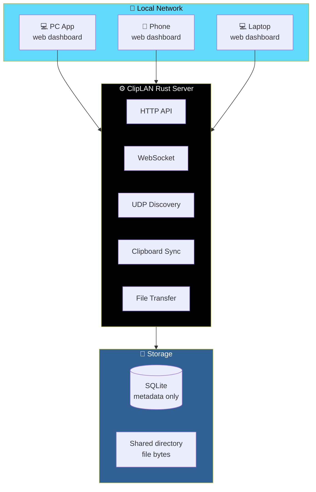
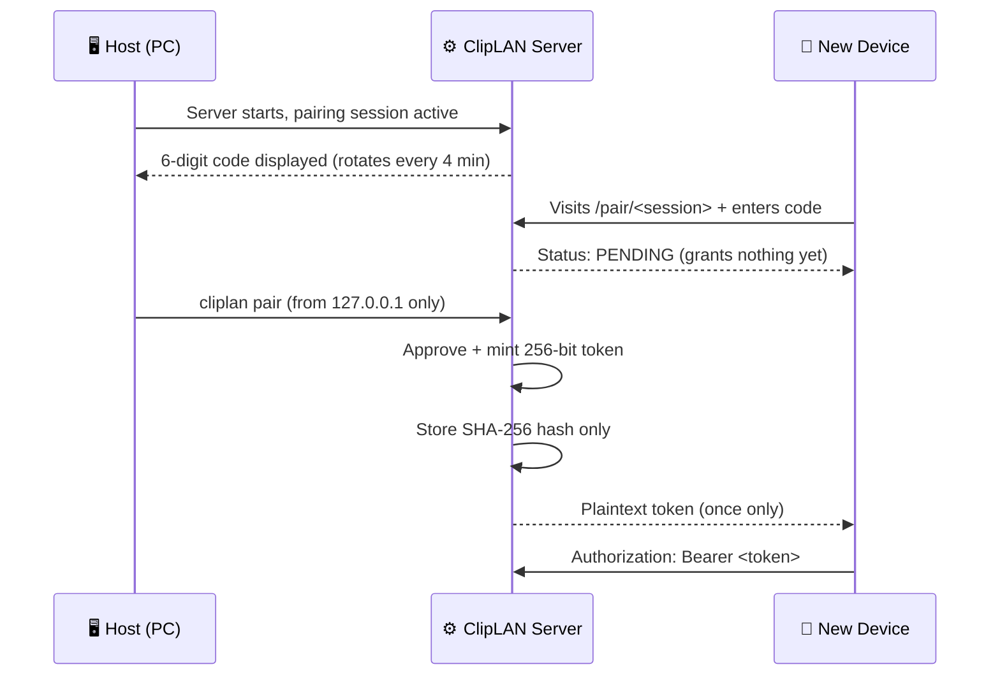

# 📋 ClipLAN

<div align="center">


**Passwordless LAN clipboard & file sharing.**

*Copy on your PC, open ClipLAN on your phone, paste.*

[✨ Overview](#-overview) • [🚀 Quick Start](#-quick-start) • [🏗️ Architecture](#-architecture) • [🔐 Security](#-security-documentation) • [🗺️ Roadmap](#-roadmap)

</div>

---

## 📖 Overview

**ClipLAN** is a **passwordless LAN clipboard and file sharing tool**.

```
Copy on PC → open ClipLAN on phone → paste/copy/download instantly.
```

**No accounts. No cloud. No internet connection required** — everything stays on your local network.

### ⚠️ Status — Please Read

> **This is a working V1 implementation.**
>
> It was written and reviewed carefully, but **could not be compiled or run in the environment that produced it** — that sandbox has no Rust toolchain and no network access to fetch crates.

**Before you trust it, run the standard checks yourself:**

```bash
cargo check
cargo test
cargo build --release
cargo run --release
```

> 💡 **Please treat this as a solid first draft that needs a normal edit/compile/fix loop**, not as pre-verified working code. If `cargo check` turns up issues, they're most likely small *(a type mismatch, an import)* rather than structural — the architecture and logic have been designed and reviewed end-to-end.

---

## 🚀 Quick Start

### 1. Build

```bash
cargo build --release
```

### 2. Run on Your PC

```bash
./target/release/cliplan
```

You'll see something like:

```
╭──────────────────────────────────╮
│           📋 ClipLAN              │
╰──────────────────────────────────╯

Status:       ● Running
Port:         8787
Address:      192.168.1.25

Web:
http://192.168.1.25:8787

Pairing code (enter this on the connecting device): 483920
[QR code]
```

### 3. Connect Your Phone

On your phone *(same Wi-Fi)*:

- **Scan the QR code**, or
- **Open the address shown** and enter the pairing code plus a name for your phone

### 4. Approve on the PC

```bash
cliplan pair
```

**Once approved**, the phone is paired. Copy something on the PC and it shows up on the phone within moments — and vice versa. **Drag a file onto the dashboard** on either device to send it to the other.

---

## 🛠️ CLI

```
cliplan                 Run the server (default)
cliplan status           Show server status
cliplan pair             Review / approve / reject pending pairing requests
cliplan devices          Show pending pairing requests
cliplan history           Hint for viewing clipboard history
cliplan config            Print the resolved configuration
```

### Flags *(apply to the default run command)*

```
--port <PORT>
--directory <DIR>
--no-discovery
--no-clipboard
--config <PATH>
```

---

## ⚙️ Configuration

Config lives at **`~/.cliplan/config.toml`**:

```toml
port = 8787
shared_directory = "./files"
max_upload_size = 1073741824
clipboard_sync = true
clipboard_history = true
discovery = true
```

### Data Layout

```
~/.cliplan/
├── cliplan.db      # sqlite metadata only — devices, clipboard entries, transfer records
├── files/          # actual uploaded file bytes
└── config.toml
```

---

## 🏗️ Architecture



### One Binary, Everything Served

A **single Rust binary** *(Axum + Tokio)* serves both:

- The **REST/WebSocket API**
- The **static web frontend** — embedded into the binary at compile time via `include_str!`

**Result:** one file to ship.

**SQLite stores metadata only.** File bytes live on disk under the configured shared directory.

### Project Structure

```
src/
├── main.rs        CLI entry point (thin — delegates to the `cliplan` library)
├── lib.rs         Library root, re-exports every module
├── config.rs       Config file + CLI-flag loading
├── server.rs        AppState, router assembly, startup banner
├── error.rs        Central AppError → HTTP response mapping
├── api/            HTTP handlers + auth extractors
├── clipboard/      Content-type detection; optional desktop clipboard watcher
├── discovery/       UDP broadcast LAN discovery
├── pairing/         Pairing session (code/QR) + device identity
├── websocket/       WebSocket upgrade handler + event types
├── storage/         SQLite schema & queries, shared data models
└── transfer/         Upload streaming+hashing, download+Range serving, filename sanitization

web/                Vanilla HTML/CSS/JS frontend (no framework, no build step)
tests/              Integration tests that boot a real server and hit it over HTTP
```

### 🔐 Pairing & Authentication Model

**ClipLAN has no user accounts or passwords, but it is NOT unauthenticated.**



**The step-by-step flow:**

1. **The server always keeps one pairing session active**, rotating every **4 minutes**. Its 6-digit code is shown on the host's terminal — and on the dashboard at `http://localhost:<port>` if opened on the host itself. The QR code just encodes the pairing URL (`/pair/<session>`) so a phone doesn't have to type an IP address — **the code still has to be entered separately**.
2. **A new device visits that URL**, submits a display name, and gets back a **pending** request. **This grants nothing yet.**
3. **Approval requires a request from the host machine itself** (`127.0.0.1` / `::1` — **enforced by checking the TCP peer address**, not a header a client could fake). This is the actual trust boundary: **anyone on the LAN can *ask* to pair, only someone with local access to the host can *approve*.**
4. **On approval**, the server mints a random **256-bit token**, stores only its **SHA-256 hash**, and hands the plaintext token to the device **exactly once**. Every subsequent request carries it as `Authorization: Bearer <token>`. The WebSocket carries it as a `?token=` query parameter since browsers can't set custom headers on the handshake.
5. **Wrong codes count against a per-session attempt limit (5)** — exceeding it invalidates the session outright rather than letting someone grind through all **1,000,000 six-digit codes**.

### 🔒 File Transfer Integrity

<div align="center">

| Guarantee | How It's Enforced |
|-----------|------------------|
| **Hash verified, not just received** | Uploads stream straight to disk *(never buffered whole in memory)* while being hashed with **SHA-256 incrementally**. "Transfer complete" always means **"hash verified"** — not **"bytes arrived"** |
| **No path traversal** | Filenames are sanitized to a **single safe path component**; files are **always written under a UUID-prefixed name** inside the configured shared directory. A malicious filename *(`../../etc/passwd` and friends)* can't be used to write outside it |
| **Resumable downloads** | Downloads support HTTP **`Range`** requests — so a client can resume an interrupted download **without ClipLAN needing a bespoke resume protocol** |

</div>

---

## 🔐 Security Documentation

### 🚨 Transport — Read This Before Using on Untrusted Networks

> **V1 serves plain HTTP.**
>
> **This means anyone who can sniff your LAN traffic** *(e.g. a compromised device on the same Wi-Fi, or a malicious access point)* **can see clipboard contents, file contents, and bearer tokens in transit.**

**The architecture doesn't assume HTTP, though:**

- Swapping in **`axum-server`'s TLS support** *(a self-signed or locally-trusted cert)* is a **config change, not a redesign**
- It is the **first thing to add** before using ClipLAN on any network you don't fully trust

### 🛡️ Trust Model

- **Pairing approval is gated on loopback-only access**
- Being on the same Wi-Fi is enough to **request** pairing — **never enough to *get* paired**

### 🔑 Tokens

- Only **SHA-256 hashes** are stored
- The **one-time plaintext token handoff** happens over a normal API response — **not embedded in a URL or QR code**

### 📁 Filesystem

- Uploaded filenames are **sanitized** *(path separators and traversal sequences stripped)*
- Files are stored under **UUID-prefixed names** inside a **fixed directory**
- **Canonicalization check on download** as defense in depth
- **There is no endpoint that opens an arbitrary path from client input**

### 📏 Size Limits

| Layer | Limit |
|-------|-------|
| **Outer** | `axum::extract::DefaultBodyLimit` |
| **Inner streaming check** | Stops and **deletes the partial file** if exceeded |
| **Clipboard entries** | Capped at **256 KiB** |

### 📝 Logging

**`tracing` logs:**

- ✅ Device names
- ✅ Filenames
- ✅ Sizes
- ✅ Hashes

**Never logs:**

- ❌ Clipboard contents
- ❌ Tokens
- ❌ Keys

### ⚠️ What's Not Done Yet

- **Rate limiting is only implemented for pairing code guesses** — not general API traffic
- **No per-IP throttle** on repeated failed-auth requests

> 📖 **See [Roadmap](#-roadmap).**

---

## 🧪 Testing

```bash
cargo test
```

`tests/` **boots a real ClipLAN instance per test** *(ephemeral port, throwaway temp directory)* and drives it over **actual HTTP** with `reqwest`, plus a few `#[cfg(test)]` unit tests inline in `src/` for pure functions *(filename sanitization, content-type detection)*.

<div align="center">

| Test File | What It Covers |
|-----------|---------------|
| **`tests/pairing.rs`** | Pairing succeeds and grants a working token · wrong codes are rejected · unapproved/rejected requests never yield a token |
| **`tests/api.rs`** | Auth is required on protected endpoints · clipboard create/list/delete roundtrip · device rename |
| **`tests/transfer.rs`** | Upload → download roundtrip byte-for-byte with **matching SHA-256** · oversized uploads rejected · deleting a transfer removes the file from disk |
| **`tests/security.rs`** | Path-traversal filenames get sanitized · invalid/missing bearer tokens rejected · unknown transfer IDs 404 instead of leaking a stack trace · oversized clipboard content rejected |

</div>

---

## 🖥️ Desktop Clipboard Agent *(optional)*

Section 5's **"Mode B"** — watching the OS clipboard in the background — is implemented **behind a Cargo feature**, so the default build doesn't pull in platform clipboard bindings:

```bash
cargo build --release --features agent
```

---

## 🗺️ Roadmap

### ✅ V1 (This Release)

- [x] Rust server
- [x] Web interface
- [x] QR + code pairing
- [x] Device pairing/approval
- [x] Text clipboard sharing
- [x] File upload/download with **SHA-256 verification**
- [x] WebSocket live updates
- [x] SQLite metadata
- [x] Transfer history
- [x] Responsive mobile UI

### 🔜 V1.1

- [ ] **Desktop clipboard monitoring** — implemented behind `--features agent`; **needs real-device testing** across platforms
- [ ] **LAN discovery** — implemented; **needs real-network testing** across router/AP configurations
- [ ] **Multiple simultaneous transfers** — the server already handles concurrent uploads; **needs frontend polish** for a nicer multi-transfer UI
- [ ] **Transfer cancellation** — client-side abort is wired up; no server-side partial-upload resume yet
- [ ] **Richer device management**

### 🚀 V2

- [ ] **Resumable uploads** — downloads already support `Range`; uploads restarting from the last byte after a dropped connection is not yet implemented
- [ ] **End-to-end encryption**
- [ ] **Native desktop tray application**
- [ ] **Native mobile apps**
- [ ] **Background sync**

---

## 🤝 Contributing

Contributions are welcome. Please:

1. Fork the repository
2. **Preserve the loopback-only approval check** — this is the trust boundary
3. **Never store plaintext tokens** — SHA-256 hashes only
4. **Sanitize every filename** before it touches the filesystem
5. **Stream and hash uploads** — never buffer whole files in memory
6. **Add tests for any new endpoint** — the integration test suite boots a real server
7. Submit a Pull Request

### Guidelines

- **Never trust a client-supplied path**
- **Never skip the canonicalization check** on download
- **Never log clipboard contents, tokens, or keys**
- **Never allow pairing approval from a non-loopback address**
- **Never bypass the size limits** — outer *and* inner

---

## 📜 License

MIT — see [LICENSE](LICENSE) for details.

---

## 🙏 Acknowledgments

- **Axum** — for a router that's a pleasure to test
- **Tokio** — for making async Rust feel natural
- **SQLite** — for metadata storage that never gets in the way
- **Every developer who's ever emailed themselves a URL** — this is for you

---

<div align="center">

### 📋 COPY. PASTE. SHARE. DONE.

**No accounts. No cloud. No internet required.**

**Everything stays on your local network.**

<br>

### 🌐 **Same Wi-Fi. Same clipboard. Same files.**

<br>

⭐ If this project helped you, consider giving it a star.

<br>

[⬆ Back to Top](#-cliplan)

</div>
